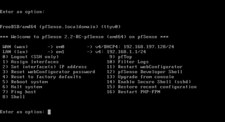
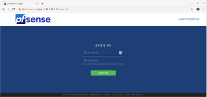




# PfSense

Welkom op de informatiepagina van pfSense.


## Wat
PfSense is een gratis en open-source firewall gebaseerd op FreeBDS distro's. U kunt de firewall op fysieke als ook op virtuele machines installeren en runnen. Na de installatie kunt u de firewall beheren via een eenvoudige web-interface. PfSense firewall heeft een tal van opties om netwerken te beveiligen, onder andere:

* DPI (Deep packet inspection)
* Intrusion Detection System
* Intrusion Prevention System
* Geo Blocking
* DNS sinkhole
* IP blacklists
* Additional applications en features  

## Installatie 
De installatie van pfSense is vrij eenvoudig te doorlopen. Wat wel voor enige verwarring kan zorgen, is de virtualisatie. Dit geeft een extra laag van abstractie. Het belangrijkste is het juist toewijzen van de netwerkinterfaces, namelijk de WAN aan de WAN-kant en niet omgekeerd. 

De installatie zelf verloopt via een aantal stappen:
* Download de recenste stabiele versie als ISO file via de [website](https://www.pfsense.org/download/)
* Maak een nieuwe VM in Proxmox met ISO gemount en start de VM
* Accepteer de voorwaarden en kies 'install'
* Volg de default settings en installeer

* Na de installatie en het heropstarten, moet u de interfaces instellen via de CLI
    * via optie 1 stelt u de WAN en LAN interfaces in (dit kan via MAC address, identificeren, zie onder 'VM Netwerk Settings')
    * via optie 2 kunt u instellen welke IP's of DHCP settings de interfaces krijgen
        

* Nadien kunt u via de LAN-kant de webinterface bereiken via het IP adres van de LAN-interface


## Proxmox bijkomende instellingen
Om de installatie en correcte werking van pfSense te garanderen, moet u de hierna volgende netwerkinstellingen in Proxmox maken. Nadien moet u ook binnen pfSense nog een optie aanpassen om de virtuele werking te garanderen. 

### Proxmox network settings
De firewall VM heeft 2 netwerkinterfaces toegewezen gekregen binnen Proxmox. In de Proxmox-omgeving moeten er 2 netwerken zijn. 
Het eerste netwerk zal als het WAN-netwerk dienen. Hiervoor kunt u het default aanwezige netwerk gebruiken ```vmbr0```. Dit is dus een netwerk dat fysiek op de Proxmox-omgeving aangesloten is. 

Voor het LAN-netwerk moet u binnen Proxmox een 2de netwerk aanmaken ```vmbr2```. Hier wordt echter geen fysieke interface aan gekoppeld. Het is dus een netwerk dat enkel virtueel aanwezig is binnen de Proxmox-omgeving. Enkel VM's met een interface van dit netwerk zijn ook verbonden met dit netwerk. 


_Fysieke interface eno3 is niet aangesloten op de Proxmox server_

### VM netwerk settings
Op de pfSense VM moet u 2 netwerkinterfaces toewijzen:
* 1 WAN Interface ```vmbr0```
* 1 LAN Interface ```vmbr2```


Hier kunt u ook de bijhorende Mac addressen bekijken om te bepalen welke interface u binnen pfSense moet instellen als WAN of LAN.

### PfSense settings
Binnen pfSense moet u één instelling wijzigen om de werking binnen een virtuele omgeving te garanderen en optimaliseren. Deze instelling kunt u via de webinterface aanpassen onder: 
* Systeem > Advanced 
* Tabblad Networking
* Onderaan de pagina > Disable hardware checksum offload


Schakel deze optie aan. Dit zorgt ervoor dat de checksum niet door de netwerkkaart gebeurt, maar door de VM zelf. Moest dit op de netwerkkaart zelf gebeuren, kan dit voor problemen zorgen door incompatibele drivers enzovoort.

## Zie ook
* [Configuratie Rules](/{{ site.RepoName }}/CCS/pfSense/Config)
* [Netwerk](/{{ site.RepoName }}/CCS/Netwerk/)

## Bronnen 
* [pfSense in Proxmox guide ](https://docs.netgate.com/pfsense/en/latest/virtualization/virtualizing-pfsense-with-proxmox.html)
* [pfSense installation guide ](https://docs.netgate.com/pfsense/en/latest/install/installing-pfsense.html)


